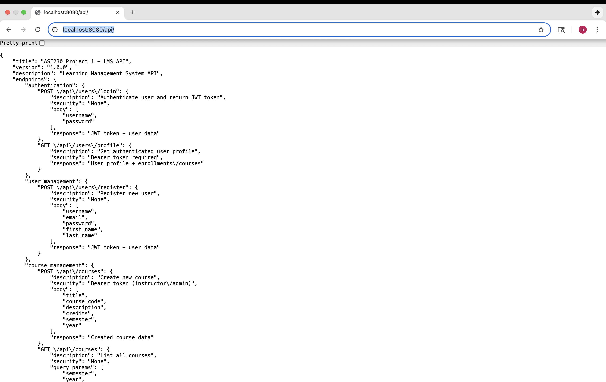

# ASE230 LMS API - How to Put It Online

## How to Make Your Website Live

**Made by:** Bishal Bhandari  
**Class:** ASE230 - Server-Side Programming  
**Date:** October 2025

---

# Getting Ready to Go Live

## 🚀 What you need before putting your website online

### What you need:
- ✅ PHP 7.4+ with MySQL support
- ✅ MySQL 5.7+ or MariaDB 10.3+
- ✅ Web server (Apache/Nginx)
- ✅ SSL certificate for HTTPS
- ✅ Domain name configured

### What your server needs:
- **PHP Extensions:** PDO, JSON, OpenSSL
- **Memory:** At least 256MB PHP memory limit
- **Storage:** 1GB+ for your website and database

---

# Setting Up Your Web Server

## 🔧 How to configure your web server

### Apache Configuration
```apache
<VirtualHost *:80>
    ServerName your-domain.com
    DocumentRoot /var/www/html/ase230-lms
    
    <Directory /var/www/html/ase230-lms>
        AllowOverride All
        Require all granted
    </Directory>
    
    # Send everyone to HTTPS
    RewriteEngine On
    RewriteCond %{HTTPS} off
    RewriteRule ^(.*)$ https://%{HTTP_HOST}%{REQUEST_URI} [L,R=301]
</VirtualHost>
```

### Nginx Configuration
```nginx
server {
    listen 80;
    server_name your-domain.com;
    return 301 https://$server_name$request_uri;
}

server {
    listen 443 ssl;
    server_name your-domain.com;
    root /var/www/html/ase230-lms;
    
    ssl_certificate /path/to/certificate.crt;
    ssl_certificate_key /path/to/private.key;
}
```

---

# NGINX Working Successfully

## 🌐 Proof that NGINX is serving your API



---

# Setting Up Your Database

## 🗄️ How to set up MySQL database

### 1. Create Database
```sql
CREATE DATABASE ase230_lms CHARACTER SET utf8mb4 COLLATE utf8mb4_unicode_ci;
CREATE USER 'lms_user'@'localhost' IDENTIFIED BY 'secure_password';
GRANT ALL PRIVILEGES ON ase230_lms.* TO 'lms_user'@'localhost';
FLUSH PRIVILEGES;
```

### 2. Import Your Data
```bash
mysql -u lms_user -p ase230_lms < database_schema.sql
```

### 3. Update Your Settings
```php
// config/db.php
<?php
return [
    'host' => 'localhost',
    'dbname' => 'ase230_lms',
    'username' => 'lms_user',
    'password' => 'secure_password',
    'charset' => 'utf8mb4'
];
```

---

# Keeping Things Safe

## 🔐 How to make your website secure

### 1. Environment Variables
```bash
# .env file
DB_HOST=localhost
DB_NAME=ase230_lms
DB_USER=lms_user
DB_PASS=secure_password
JWT_SECRET=your_super_secret_jwt_key_here
API_BASE_URL=https://your-domain.com/api
```

### 2. File Permissions
```bash
# Set proper permissions
chmod 755 /var/www/html/ase230-lms
chmod 644 /var/www/html/ase230-lms/config/db.php
chmod -R 755 /var/www/html/ase230-lms/api
```

### 3. Security Headers
```php
// Add to index.php
header('X-Content-Type-Options: nosniff');
header('X-Frame-Options: DENY');
header('X-XSS-Protection: 1; mode=block');
header('Strict-Transport-Security: max-age=31536000');
```

---

# Setting Up HTTPS

## 🔒 How to get free SSL certificate

### Let's Encrypt (Free SSL)
```bash
# Install Certbot
sudo apt-get install certbot python3-certbot-apache

# Get certificate
sudo certbot --apache -d your-domain.com

# Auto-renewal
sudo crontab -e
# Add: 0 12 * * * /usr/bin/certbot renew --quiet
```

### SSL Best Practices
- **TLS Version:** At least TLS 1.2
- **Cipher Suites:** Strong encryption only
- **HSTS:** Enable HTTP Strict Transport Security
- **Certificate:** Valid, trusted CA-signed certificate

---

# Making It Faster

## ⚡ How to make your website run better

### 1. PHP Configuration
```ini
; php.ini optimizations
memory_limit = 512M
max_execution_time = 30
upload_max_filesize = 10M
post_max_size = 10M
opcache.enable = 1
opcache.memory_consumption = 128
```

### 2. Database Optimization
```sql
-- Add indexes for better performance
CREATE INDEX idx_users_email ON users(email);
CREATE INDEX idx_courses_semester_year ON courses(semester, year);
CREATE INDEX idx_enrollments_student_course ON enrollments(student_id, course_id);
```

### 3. Caching Strategy
- **OPcache:** Enable for PHP bytecode caching
- **Database Query Caching:** Cache frequently accessed data
- **API Response Caching:** Cache static data responses

---

# Watching Your Website

## 📊 How to keep track of what's happening

### 1. Error Logging
```php
// Log configuration
ini_set('log_errors', 1);
ini_set('error_log', '/var/log/php/ase230-lms-errors.log');
```

### 2. Application Logs
```php
// Custom logging function
function logAPI($message, $level = 'INFO') {
    $timestamp = date('Y-m-d H:i:s');
    $logEntry = "[$timestamp] [$level] $message" . PHP_EOL;
    file_put_contents('/var/log/ase230-lms/app.log', $logEntry, FILE_APPEND);
}
```

### 3. Health Checks
- **Database Connectivity:** Regular connection tests
- **API Endpoint Status:** Automated endpoint monitoring
- **SSL Certificate Expiry:** Monitor certificate validity

---

# Backing Up Your Data

## 💾 How to save your data safely

### 1. Database Backups
```bash
#!/bin/bash
# Daily backup script
DATE=$(date +%Y%m%d_%H%M%S)
mysqldump -u lms_user -p ase230_lms > /backups/lms_backup_$DATE.sql
gzip /backups/lms_backup_$DATE.sql

# Keep only last 30 days
find /backups -name "lms_backup_*.sql.gz" -mtime +30 -delete
```

### 2. Application Backups
```bash
# Backup application files
tar -czf /backups/app_backup_$(date +%Y%m%d).tar.gz /var/www/html/ase230-lms
```

### 3. Recovery Procedures
- **Database Recovery:** Restore from latest backup
- **Application Recovery:** Deploy from version control
- **Full System Recovery:** Complete server restoration

---

# Deployment Process

## 🚀 Automated Deployment

### 1. Git-based Deployment
```bash
#!/bin/bash
# deploy.sh script
cd /var/www/html/ase230-lms
git pull origin main
composer install --no-dev --optimize-autoloader
php artisan config:cache
php artisan route:cache
```

### 2. CI/CD Pipeline
```yaml
# .github/workflows/deploy.yml
name: Deploy to Production
on:
  push:
    branches: [main]
jobs:
  deploy:
    runs-on: ubuntu-latest
    steps:
      - uses: actions/checkout@v2
      - name: Deploy to server
        run: |
          # Deployment commands
```

### 3. Rollback Strategy
- **Database Migrations:** Reversible migration scripts
- **Application Versions:** Git tag-based versioning
- **Quick Rollback:** Automated rollback procedures

---

# Testing in Production

## 🧪 Production Testing

### 1. Smoke Tests
```bash
# Basic functionality tests
curl -f https://your-domain.com/api/courses
curl -f https://your-domain.com/api/users/register -X POST
```

### 2. Load Testing
```bash
# Using Apache Bench
ab -n 1000 -c 10 https://your-domain.com/api/courses
```

### 3. Security Testing
- **SSL Labs Test:** Check SSL configuration
- **OWASP ZAP:** Automated security scanning
- **Penetration Testing:** Regular security audits

---

# Maintenance & Updates

## 🔧 Ongoing Maintenance

### 1. Regular Updates
- **PHP Updates:** Keep PHP version current
- **Security Patches:** Apply OS and application patches
- **Dependencies:** Update third-party libraries

### 2. Performance Monitoring
- **Response Times:** Monitor API response times
- **Error Rates:** Track application error rates
- **Resource Usage:** Monitor server resources

### 3. Documentation Updates
- **API Documentation:** Keep endpoint docs current
- **Deployment Procedures:** Update deployment scripts
- **Troubleshooting Guides:** Maintain runbooks

---

# Troubleshooting Guide

## 🔍 Common Issues & Solutions

### 1. Database Connection Issues
```bash
# Check database connectivity
mysql -u lms_user -p -h localhost ase230_lms -e "SELECT 1"

# Check PHP PDO extension
php -m | grep pdo
```

### 2. SSL Certificate Problems
```bash
# Check certificate validity
openssl x509 -in /path/to/certificate.crt -text -noout

# Test SSL connection
openssl s_client -connect your-domain.com:443
```

### 3. API Endpoint Issues
```bash
# Test API endpoints
curl -v https://your-domain.com/api/courses
curl -v -H "Authorization: Bearer token" https://your-domain.com/api/users/profile
```

---

## 🎉 Deployment Complete!

### ✅ Production Ready Features
- **Secure HTTPS Configuration**
- **Database Optimization**
- **Performance Monitoring**
- **Automated Backups**
- **Error Handling**
- **Security Hardening**

### 📞 Support & Maintenance
- **24/7 Monitoring:** Automated health checks
- **Regular Backups:** Daily automated backups
- **Security Updates:** Regular security patches
- **Performance Optimization:** Ongoing performance tuning

**Your ASE230 LMS API is now production-ready! 🚀**

---

# Github

## 📞 Github Repo 

**Repository:** [https://github.com/BsalBhandari/ase230-bhandari-project1](https://github.com/BsalBhandari/ase230-bhandari-project1)


---

# Appendix: Deployment Commands

## 🛠️ Quick Reference Commands

### Database Operations
```bash
# Backup database
mysqldump -u lms_user -p ase230_lms > backup.sql

# Restore database
mysql -u lms_user -p ase230_lms < backup.sql

# Check database status
mysqladmin -u lms_user -p status
```

### Application Management
```bash
# Check PHP configuration
php -i | grep -E "(memory_limit|max_execution_time)"

# Test API endpoints
curl -f https://your-domain.com/api/courses

# Check logs
tail -f /var/log/php/ase230-lms-errors.log
```

### Security Checks
```bash
# SSL certificate check
openssl s_client -connect your-domain.com:443

# File permissions check
find /var/www/html/ase230-lms -type f -perm 777
```
